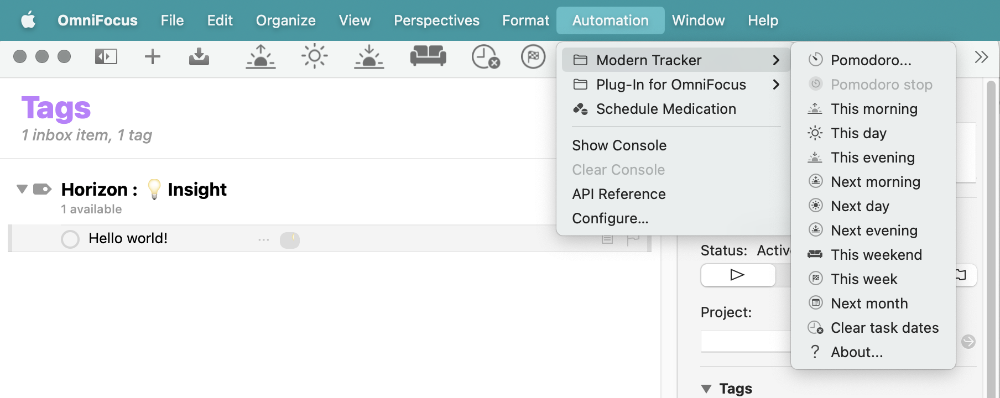

# Modern Tracker plug-in bundle for OmniFocus™️

# Motivation
Let's make OmniFocus™️ great again.

I adore the user experience of OmniFocus™️, however, I do struggle with the absence of some highly beneficial features.

Here are the features that are currently available:

- A Pomodoro timer.
- Convenient task date/time binding buttons similar to those used in TikTik™️ or Singularity™️.
- An English language pack.

# Install
- [Download release archive](https://github.com/meteozond/ModernTracker/releases).
- Extract if zipped.
- Open OmniFocus menu item - `Automation` - `Configure...` window.
- Drag [ru.erix.ModernTracker.omnifocusjs](ru.erix.ModernTracker.omnifocusjs) folder into it.
- Close `Automaion Configuration` window

# Toolbar actions
- Open OmniFocus menu item `View` - `Customize toolbar`...
- Drag'n'Drop actions you into OmniFocus Toolbar
- Close `Automaion Configuration` window
- Click `Done` button
